# <center><u>Set up Grafana , Prometheus and Blackbox Exporter </u></center>    

##### <u>Table of Content </u>  

[1 - Definition of Grafana , Prometheus and Blackbox Exporter](#1-definition-of-grafana--prometheus-and-blackbox-exporter)   

[2 - How to set up Grafana , Prometheus and Blackbox Exporter on Podman Container ?
](#2-how-to-set-up-grafana--prometheus-and-blackbox-exporter-on-podman-container)  


### 1. Definition of Grafana , Prometheus  and Blackbox Exporter 


**<center>a. Grafana**: Grafana is an open-source analytics and monitoring platform that integrates with various data sources, allowing users to visualize and understand metrics through customizable dashboards.</center>
 

**<center>b. Prometheus:** Prometheus is an open-source monitoring and alerting toolkit designed for reliability and scalability. It collects and stores time-series data, offering powerful querying and alerting capabilities.</center>   
 

 **<center>c. Blackbox Exporter:** Blackbox Exporter is a Prometheus exporter designed for probing and monitoring external services. It allows users to check the availability and response of endpoints, such as HTTP, TCP, ICMP, and DNS, and generates metrics based on the results.</center>


### 2. How to set up Grafana , Prometheus and Blackbox Exporter on Podman Container ?   


#### **System Requirement**  

* **Distributor ID:	Ubuntu**
  **Description:	Ubuntu 22.04.3 LTS**
  **Release:	22.04**
  **Codename:	jammy**     

* **podman version 3.4.4**  


#### Step 1 . First, we will update and upgrade our system.   

* ```sudo apt update```     

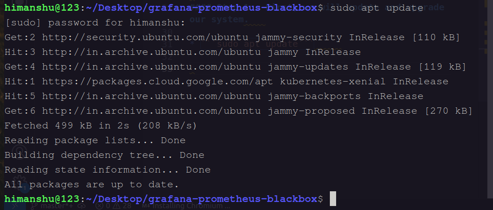   

* ```sudo apt upgrade```

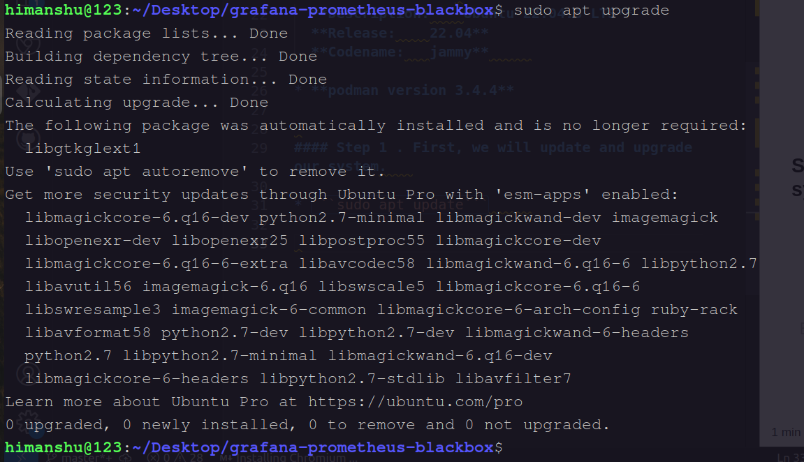   

#### Step 2 .   Create File and Folder regarding this set up .   

* ```mkdir grafana```

* ```cd grafana```      

* ```touch prometheus.yml```   

* ```touch config.yml```   

* ```ls``` : **Check List**  

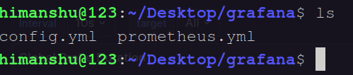  

#### Step 3 . Paste code in prometheus.yml and config.yml file .     

* ```vim prometheus.yml```      


**Paste code in this configuration file .**  

    global:
      scrape_interval: 15s
      scrape_timeout: 10s
      evaluation_interval: 15s

    scrape_configs:
      - job_name: 'prometheus'
        scrape_interval: 5s
        static_configs:
          - targets: ['192.168.1.113:9090', '192.168.1.113:9115']

      - job_name: 'blackbox'
        metrics_path: /probe
        params:
          module: [http_2xx]

        static_configs:
          - targets:
            - https://www.google.com  

        relabel_configs:
          - source_labels: [__address__]
            target_label: __param_target
          - source_labels: [__param_target]
            target_label: instance
          - target_label: __address__
            replacement: 192.168.1.113:9115     

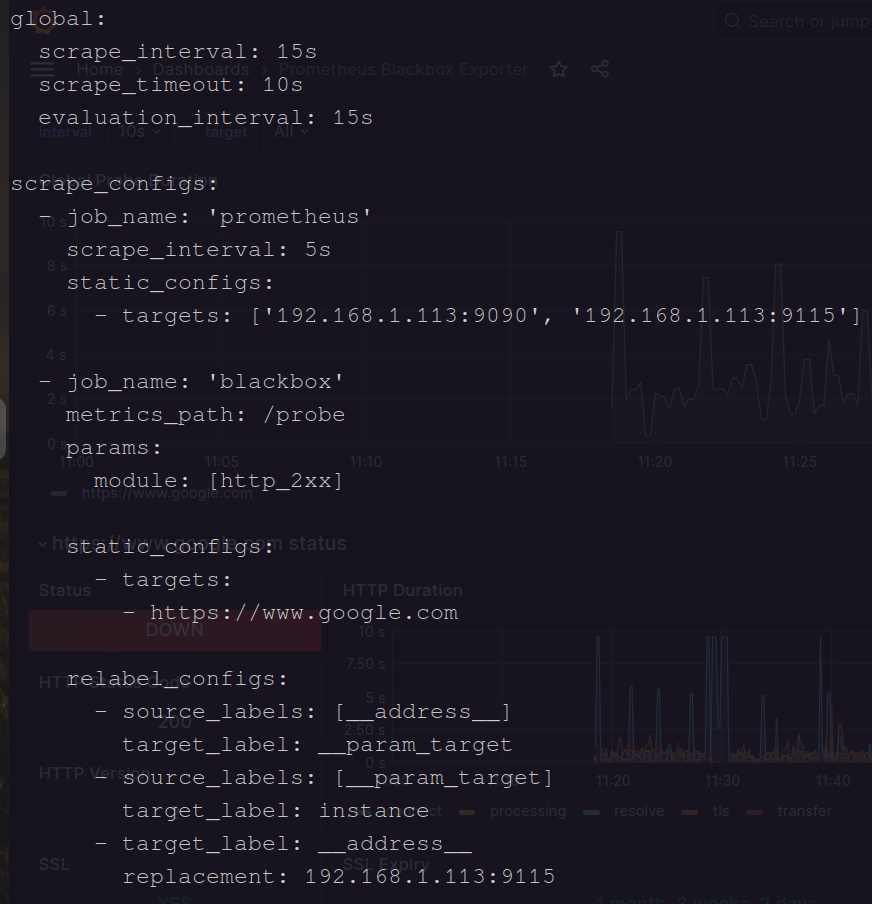      

* ```vim config.yml``` 

**Paste code in this configuration file .**  

    modules:
      http_2xx:
        prober: http
      http_post_2xx:
        prober: http
        http:
          method: POST
      tcp_connect:
        prober: tcp
      pop3s_banner:
        prober: tcp
        tcp:
          query_response:
          - expect: "^+OK"
          tls: true
          tls_config:
            insecure_skip_verify: false
      grpc:
        prober: grpc
        grpc:
          tls: true
          preferred_ip_protocol: "ip4"
      grpc_plain:
        prober: grpc
        grpc:
          tls: false
          service: "service1"
      ssh_banner:
        prober: tcp
        tcp:
          query_response:
          - expect: "^SSH-2.0-"
          - send: "SSH-2.0-blackbox-ssh-check"
      irc_banner:
        prober: tcp
        tcp:
          query_response:
          - send: "NICK prober"
          - send: "USER prober prober prober :prober"
          - expect: "PING :([^ ]+)"
            send: "PONG ${1}"
          - expect: "^:[^ ]+ 001"
      icmp:
        prober: icmp
      icmp_ttl5:
        prober: icmp
        timeout: 5s
        icmp:
          ttl: 5      


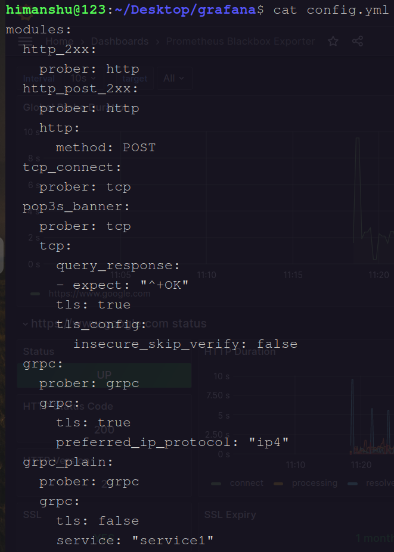 

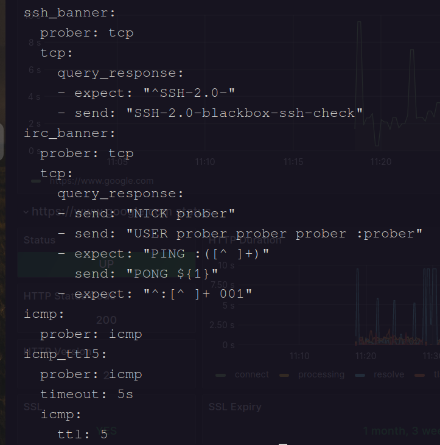     


#### Step 4 .  Run the container Prometheus on podman .    

* ```podman run -p 9090:9090 -v /home/himanshu/Desktop/grafana/prometheus.yml:/etc/prometheus/prometheus.yml /prom/prometheus```   


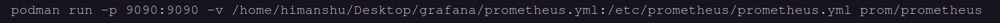  

* **podman run:** This is the basic command to run a container using Podman. Podman is a container management tool similar to Docker.

* **-p 9090:9090:** This part of the command specifies port mapping. It maps port 9090 from the container to port 9090 on the host. This is typically done to allow external access to the service running inside the container on port 9090.

* **-v /home/himanshu/Desktop/grafana/prometheus.yml:/etc/prometheus/prometheus.yml:** This part specifies a volume mount. It takes a file from the host system and mounts it into the container. In this case, it's taking the file located at /home/himanshu/Desktop/grafana/prometheus.yml on the host and mounting it into the container at **/etc/prometheus/prometheus.yml**. This is often used for configuration files, so the Prometheus configuration can be customized.    

* **/prom/prometheus:** This is the name of the container image that you want to run. In this case, it seems to be referring to a container image named "prom/prometheus," which is likely an official Prometheus container image.   


* ```podman images``` : check images .   

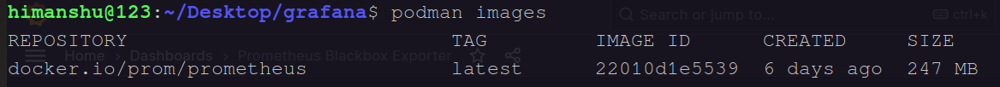   

* ```podman ps``` : check container .  

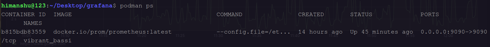   

* show on Localhost : http://localhost:9090  

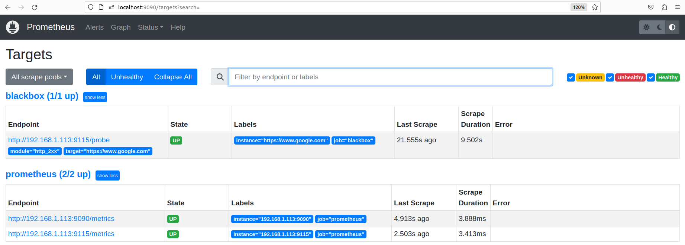   

### Step 5 .  Run the container Blackbox Exporter on podman  .    

* ```podman run -d --name black -p 9115:9115  bitnami/blackbox-exporter:latest```      

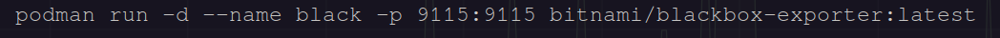  

* **podman run:** This is the basic command for running a container with Podman.

* **-d:** This flag stands for "detached" mode, which means that the container will run in the background, and you'll get your terminal prompt back immediately.

* **--name black:** This flag assigns a name "black" to the running container, allowing you to easily reference it by name instead of a container ID.

* **-p 9115:9115:** This flag maps ports between the host and the container. In this case, it's mapping port 9115 on the host to port 9115 in the container. This is useful if the container is running a service that you want to access from your host machine.

* **bitnami/blackbox-exporter:latest:** This is the name of the Docker image that you want to run as a container. It's specifying the image "bitnami/blackbox-exporter" with the "latest" tag, meaning the latest available version of that image.


* ```podman images``` : check images .   

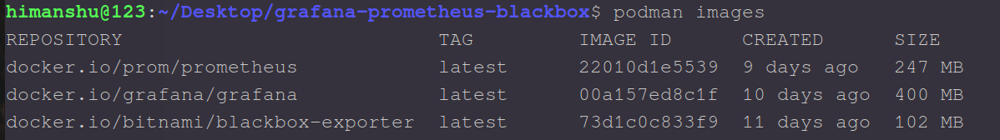  

* ```podman ps``` : check container .  

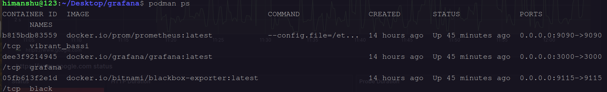  

* show on Localhost : http://localhost:9115  

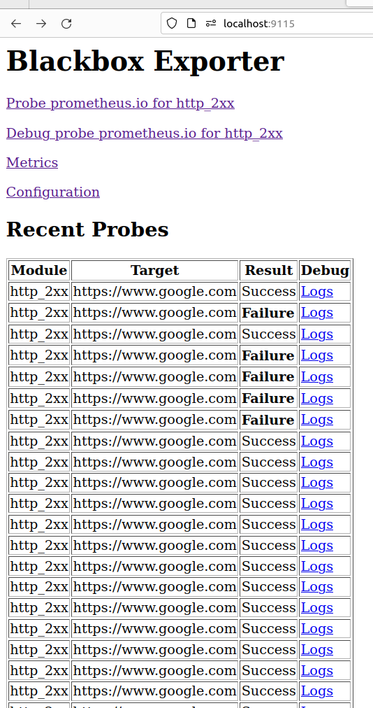  

#### Step 6 .  Run the container Grafana on podman  .

* ```podman run -d --name grafana -p 3000:3000 -e "GF_SECURITY_ADMIN_PASSWORD=admin" grafana/grafana```    


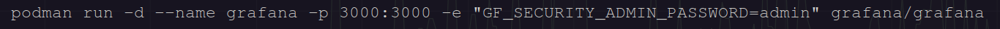     


* **podman run:** This is the command to run a container using Podman, a containerization tool similar to Docker.

* **-d:** This flag stands for "detached" mode, which means that the container will run in the background as a daemon.

* **--name grafana:** This flag assigns a name to the container, in this case, "grafana." This name can be used to reference and manage the container.

* **-p 3000:3000**: This flag is used to map ports between the host machine and the container. It specifies that port 3000 on the host should be mapped to port 3000 inside the Grafana container. This is important for accessing Grafana's web interface, as the Grafana server runs on port 3000 by default.

* **-e "GF_SECURITY_ADMIN_PASSWORD=admin":** This flag is used to set an environment variable within the container. In this case, it's setting the Grafana admin user's password to "admin." This is a common initial setup step to secure your Grafana instance.

* **grafana/grafana:** This is the name of the Docker image that you want to run. It specifies that you want to run the official Grafana Docker image from the "grafana" repository on Docker Hub.   


* ```podman images``` : check images .   

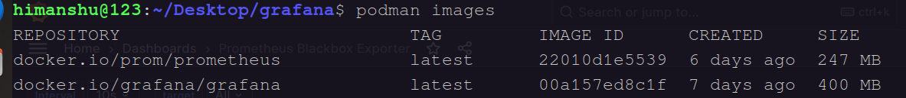  

* ```podman ps``` : check container .  

  

* show on Localhost : http://localhost:3000  

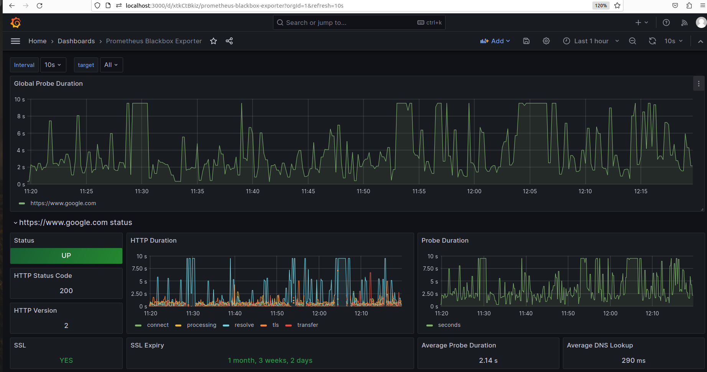 

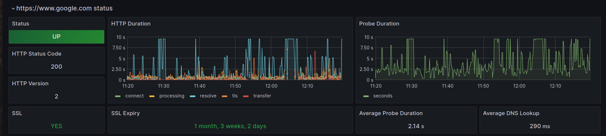    

#### Step 7 .  If a website's URL returns a low failure response, then in this situation, the dashboard will be down.  

* **Blackbox Exporter**  

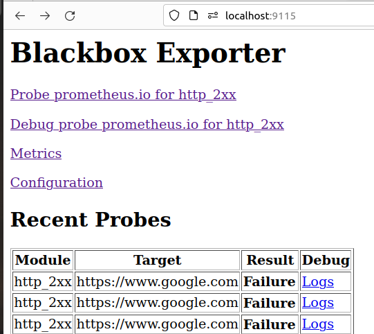   

* **Prometheus** 


* **Grafana**   

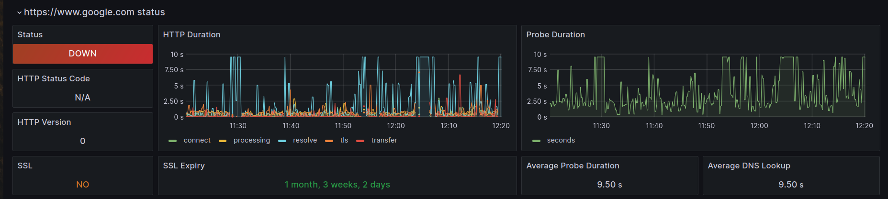