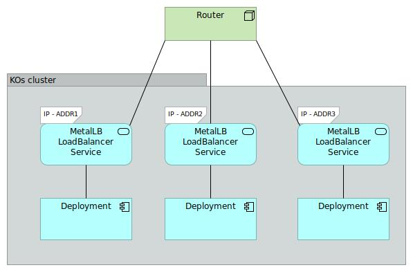
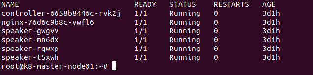
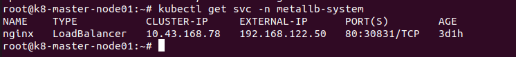

 <u> <h1 style="font-size: 50px;">MetalLB Setup</h1> </u> 

## 1 . Requirement of MetalLB :

In the bare metal deployment kubernetes does not provide the functionality of creating Load Balancer on service by default

## 2 . Environment  detail :

* **Distributor ID :**	Ubuntu
* **Description :**	Ubuntu 22.04.3 LTS
* **Release :**	22.04
* **Codename :**	jammy   	

## 3 . List of tools and technologies:

* **Kubernetes Version - 1.25**

* **MetalLB - Latest Version**

* **Podman/Docker - Latest Version**

#### a . Definition of  Kubernetes :

Think of Kubernetes as a smart manager for your applications. Imagine you have lots of little workers (containers) who need to run your programs. Kubernetes is like a boss who organizes and manages these workers efficiently. It makes sure your programs are running, scales them when needed, and even replaces them if they fail.   

#### b . Definition of  MetalLB :

Picture MetalLB as a friendly valet for your apps in Kubernetes. Normally, LoadBalancers help direct internet traffic to different services, like websites or apps. MetalLB does this even if you're not on a big cloud service (like Amazon or Google). It helps your Kubernetes apps get the right traffic and lets them talk to the world.

**MetalLB Architecture diagram :**

    

#### c . Definition of  Podman/Docker  :

Docker and Podman  are tools  used for containerization , which helps package and run applications  with all their dependencies in isolated environments. Docker is widely known and uses a central daemon, while Podman offers similar functionality without a central daemon, making it more lightweight and secure. Both simplify software deployment across different systems.

## 4 .  Command for the setup or configuration :

#### a .  Install Kubernetes :

Here's a general outline of the steps you would follow to install Kubernetes on Ubuntu:

* **Step 1 :**   **Update and Upgrade :**

		sudo apt-get update
		sudo apt-get upgrade

* **sudo :** This command is used to superuser (root) privileges.

* **"apt-get update"** updates the package index files, whereas **"apt-get upgrade"** upgrades the actual packages installed on your system

* **Step 2 :** **Install Docker :**
Kubernetes relies on Docker for containerization. Install Docker using the following commands:

		sudo apt-get install docker.io
		sudo systemctl enable docker
		sudo systemctl start docker

* **apt-get :** This is the package management command-line tool used on Debian-based distributions to handle packages.

* **install :** This is an option that allows you to install a software package.

* **systemctl :** This is the command-line interface for managing services and units in the systemd system and service manager.

* **enable :** It is used to enable the service, which means the service will automatically start on boot.

* **start :** It to used to start the specified service.

* **docker :** This is the name of the Docker service as known to systemd.

* **Step 3 :** **Install kubeadm, kubelet, and kubectl :**
These are the essential components of Kubernetes.

		sudo apt-get install -y apt-transport-https curl
		curl -s https://packages.cloud.google.com/apt/doc/apt-key.gpg | sudo apt-key add -
		echo "deb https://apt.kubernetes.io/ kubernetes-xenial main" | sudo tee /etc/apt/sources.list.d/kubernetes.list
		sudo apt-get update
		sudo apt-get install -y kubelet kubeadm kubectl

* **kubeadm :** This is the command-line tool provided by Kubernetes to bootstrap a Kubernetes cluster.

* **kebelet :** The Kubelet is responsible for managing the deployment of pods to Kubernetes nodes.

* **kubectl :** kubectl is the Kubernetes-specific command line tool that lets you communicate and control Kubernetes clusters.

* **apt-get install :** Command to install software packages.

* **-y :** This option tells apt-get to automatically answer 'yes' to all prompts. It's a way of saying, "Install the packages without asking me for confirmation."

* **apt-transport-https :** A package that allows the package management tool (apt) to retrieve packages over the HTTPS protocol. It's needed because the Kubernetes repository uses HTTPS.

* **curl :** A command-line tool for transferring data using various protocols. It's being installed because it will be used in the next command.

* **curl -s :** Fetch data from a URL. The -s flag means "silent mode," where curl doesn't show progress or error messages.

* https://packages.cloud.google.com/apt/doc/apt-key.gpg : This URL points to the GPG key used by Google Cloud's package repository (in this case, for Kubernetes).

* **|: This is a pipe .** It takes the output from the command on the left (the curl command) and uses it as input for the command on the right.

* **sudo apt-key add - :** This command adds a new GPG key to the APT keyring. The key is taken from the input (in this case, the output of the curl command). The GPG key is used to verify the integrity and origin of packages from the repository.

* **echo :** This command simply prints the string inside the quotes.

* **tee :** The tee command is used to write a standard input to standard output and a file. 

  
* **Step 4 :**  **Initialize Kubernetes Master Node (Control Plane) :**
On the master node, you'll initialize Kubernetes using kubeadm. Run the following command to initialize the master node:

		sudo kubeadm init
 

* **kubeadm :** This is the command-line tool provided by Kubernetes to bootstrap a Kubernetes cluster.

* **init :** This is the command to initialize a new Kubernetes master node.

Follow the instructions provided by the command, including setting up the network pod (CNI) and configuring kubectl for your user.  

* **Step 5 :**  **Configure Kubectl :**
You need to configure kubectl to communicate with the Kubernetes cluster. This is usually done by copying the Kubernetes configuration file into your home directory.

		mkdir -p $HOME/.kube
		sudo cp -i /etc/kubernetes/admin.conf $HOME/.kube/config
		sudo chown $(id -u):$(id -g) $HOME/.kube/config  

* **mkdir :** This is a command to create directories.

* **-p :** This option ensures that mkdir creates the directory and any necessary parent directories. If the directory already exists, it won't raise an error.

* **$HOME :** This is an environment variable pointing to the home directory of the current user.

* **/.kube :** This specifies a .kube directory within the home directory.

* **cp :** This is a command to copy files or directories.

* **-i(interactive) :** This option prompts the user before overwriting files.

* **chown :** This command changes the owner (and group) of a file or directory.

* **$(id -u) :** This is a command substitution that runs the id command with the -u option to fetch the UID (User ID) of the current user.

* **$(id -g) :** This is another command substitution that uses the id command with the -g option to fetch the GID (Group ID) of the current user.

* **$HOME/.kube/config  :** This is the file whose ownership is being changed.

* **Step 6 :** **Install a Network Plugin :**

Kubernetes requires a network plugin for communication between pods across different nodes. A popular choice is Calico:

		kubectl apply -f https://docs.projectcalico.org/v3.14/manifests/calico.yaml

* **kubectl :** This is the command-line interface for running commands against Kubernetes clusters.

* **apply :** This subcommand of kubectl is used to apply changes to resources in the cluster. It's often used to create or update resources based on manifest files.

* **-f :** This flag specifies that kubectl should take its input from a file. In this case, the file is a remote YAML file hosted on the web.

* **Step 7 :** **Join Worker Nodes (optional) :**
   
If you have worker nodes, you can join them to the cluster using the token generated during kubeadm init on the master node.   

#### b .  Install MetalLB :
MetalLB is a load balancer implementation for bare metal Kubernetes clusters. It provides a network load balancer implementation for services that use the type LoadBalancer.   

* **Step 1 :**   **Install kubectl (if not already installed) :**
If kubectl is not already installed, you can install it using the following command:

		sudo snap install kubectl --classic

* **snap :** This refers to the Snap package manager itself. Snap is a software packaging and deployment system developed by Canonical for the operating systems that use the Linux kernel.

* **kubectl :** This is the name of the package you want to install. kubectl is a command-line tool that allows you to run commands against Kubernetes clusters.

* **--classic :** This is an option that tells snap to install the package in classic mode. Classic mode is a way of running snap applications that allows them to have nearly all the freedoms of non-snap applications.

* **Step 2 :**   **Install MetalLB :**
MetalLB can be installed using Kubernetes manifests. Download the MetalLB manifest files using kubectl:

		kubectl apply -f https://raw.githubusercontent.com/metallb/metallb/v0.13.10/config/manifests/metallb-native.yaml 
		kubectl apply -f https://raw.githubusercontent.com/metallb/metallb/v0.13.10/config/manifests/metallb-frr.yaml

* **apply :** This command is used to apply configurations defined in a file or set of files to the Kubernetes cluster. 

* **-f :** This flag specifies that the source of the configuration is a file. 

#### c . Configure MetalLB : 

After installing the MetalLB manifests, you need to configure it with a Layer 2 configuration. Create a ConfigMap for MetalLB's configuration:

* **Step 1 :**  create a namespace with name metallb

		kubectl create ns metallb  

* **Step 2 :**  
  
		kubectl config set-context --current --namespace=metallb  

* **Step 3 :**   

		helm install metallb metallb/metallb

* **Step 4 :**

		Kubectl get pods -n metallb

    

**create a configmap in which we will define the range of IPs which we can provide to a service:**

		# root@k8-master-node01:~# cat cm.yaml 
		apiVersion: v1
		kind: ConfigMap
		metadata:
  		namespace: metallb-system
  		name: config
		data:
  		config: |
    	address-pools:
      - name: default
     	protocol: layer2
     	addresses:
     - <IP_RANGE_START>-<IP_RANGE_END>

Replace **<IP_RANGE_START> and <IP_RANGE_END>** with the range of IP addresses you want MetalLB to allocate from. Save this configuration in a file named metallb-config.yaml and apply it using kubectl:  

* **Step 5 :**  

		kubectl create -f cm.yaml

* **Step 6 :**    

		Deploy a sample nginx application.

* **Step 7 :**    

		kubectl create deploy nginx --image nginx

* **Step 8 :**    

		kubectl expose deploy nginx --port 80 --type LoadBalancer

    

* **Step 5 :**   **Use MetalLB :**  

Now you can create a **Kubernetes Load Balancer service** to use MetalLB. For example:

		apiVersion: v1
		kind: Service
		metadata:
  		name: my-service
		spec:
  		type: LoadBalancer
  		ports:
        - port: 80
    	targetPort: 80
  		selector:
    	app: my-app   

#### d . Test MetalLB :

Deploy a simple service to test **MetalLB's LoadBalancer functionality.** Create a file named nginx-service.yaml:   

		apiVersion: v1
		kind: Service
		metadata:
  		name: nginx-service
		spec:
  		ports:
        - port: 80
      	targetPort: 80
  		selector:
    	app: nginx-app
  		type: LoadBalancer
  

**Apply the service :**   

		kubectl apply -f nginx-service.yaml

Wait a moment, and then check the service's external IP:

		
		kubectl get svc nginx-service  
	
* **get :** This command retrieves resources from the Kubernetes cluster.

* **svc :** This is short for "service," which is a Kubernetes resource that defines a set of pods and a policy by which to access them. 

You should see an IP address assigned to the **EXTERNAL-IP** column.

MetalLB is now **set up** in your Kubernetes cluster running on Ubuntu. It's helping to distribute traffic and make your applications accessible through the IP you've configured. 

## 5 . Reference Link :  
* [Metallb setup](https://metallb.universe.tf/installation/)     

* [  Kubernetes Setup and Configuration ](https://www.linuxtechi.com/install-kubernetes-on-ubuntu-22-04/)    

* [ Metallb Setup and Configuration ](https://www.itsupportwale.com/blog/how-to-install-and-configure-metallb-on-self-managed-kubernetes/)   

